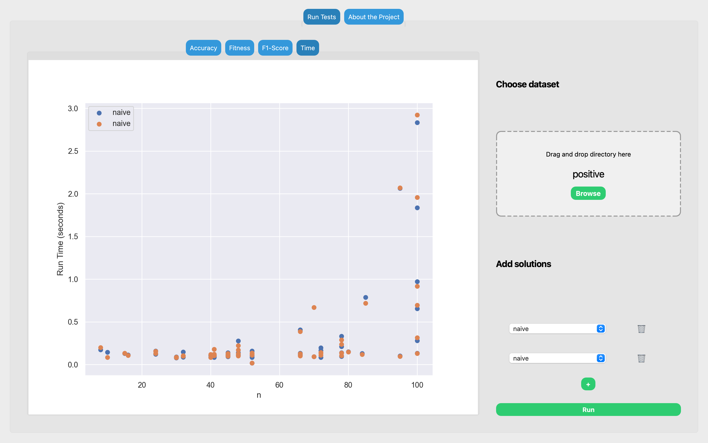

# Project of Evolutionary Algorithm for Solving Subset Sum Problem

Project implements multiple algorithms, including:
- evolutionary algorithm ('ga.py')
- Fully polynomial-time approximation scheme ('fptas.py') 
- naive appreach ('naive.py')

The application features a simple GUI to compare solutions on prepared datasets in terms of efficiency and correctness. 
Running the application consists of:
1. Choosing the solutions on the right, add a solution with the '+' button and choose the solution
2. Choose dataset, browse to choose from the prepared datasets in the data directory (a dataset is a directory of .in and .out files)
3. CLick Run
4. Observe Accuracy, Score and runtimes on the graphs on the left and progress of solutions on the right.

## Set-up
In order to run the application 'Python version >=3.9.16' is recommeneded. Moveover, project uses many dependencies for GUI and those have to be installed. Use of a virtual environment is highly adivesed.

# Installing dependencies
Start by creating a new virtual environment
'''
python3 -m venv name_of_env
'''

Then, activate it with
'''
source name_of_env/bin/activate
'''

Finally, intally all dependencies from 'requirements.txt' using 'pip' with
'''
pip install -r requirements.txt
'''

# Run the app
Start the app with
'''
python3 main.py
'''

## Gallery
